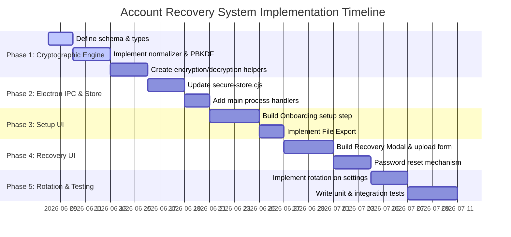

# Account Recovery System - Implementation Plan

> **Document version:** 1.3-draft  
> **Author:** Antigravity Architecture Pass  
> **Last updated:** 2026-06-06  
> **Status:** Pre-implementation planning  
> **Product:** Carbon - AI-powered SSH terminal platform

---

## Executive Summary

Carbon secures its user connections, credentials, and AI keys using OS-level secure storage (`safeStorage` via Electron) and gates access using an App Lock password or passkey. If a user forgets their App Lock password, they are locked out of the application permanently.

This implementation plan defines a self-custodial, privacy-preserving **Dual-Mode Account Recovery System**. To prevent users from silently skipping or auto-accepting weaker settings, **users must explicitly select** their recovery mode during configuration:

1. **Standard Recovery**: Offline recovery relying on **3 custom Recovery Passphrases**.
2. **Advanced Recovery**: Offline multi-factor recovery requiring both **3 custom Recovery Passphrases** and a **Recovery Key File** (`carbon-recovery.key`).

By using an Argon2id key derivation process and AES-256-GCM metadata wrapping, the system guarantees that recovery secrets are never stored in plaintext, verification runs fully offline, and an Advanced Recovery setup cannot be silently bypassed or downgraded. All operations reuse Carbon's existing UI primitives, maintaining a cohesive look and feel.

---

## 1. Recovery Modes Specification

### A. Explicit User Selection

To avoid accidental clicks and encourage users to adopt appropriate security posture, **neither mode is enabled by default**. During setup/onboarding, the user must explicitly choose one of the two modes:

- **Standard Recovery (Passphrases only)**
- **Advanced Recovery (Passphrases + Recovery Key)**

### B. Standard Recovery (Passphrases Only)

- **Factors Required**: 3 user-defined Recovery Passphrases.
- **Key File**: None.
- **Security Profile**: Protects against forgotten password lockouts. Relies solely on the memorability and complexity of the user's custom passphrases.

### C. Advanced Recovery (Passphrases + Recovery Key)

- **Factors Required**: Both **3 user-defined Recovery Passphrases** AND the physical **Recovery Key File** (`carbon-recovery.key`).
- **Cryptographic Binding**: Neither factor alone is sufficient to recover the account. Possession of only the file, or only the passphrases, will fail verification.
- **No Downgrades**: If a user configures Advanced Recovery, the system will never permit a fallback to Standard (passphrase-only) recovery. The file upload step is mandatory. If the file is missing or corrupted, recovery will fail.

---

## 2. Current Repo Fit

The proposed recovery system integrates with the following existing code boundaries:

| Area                    | Current File                                                                                       | Why it Matters                                                                                                                                |
| ----------------------- | -------------------------------------------------------------------------------------------------- | --------------------------------------------------------------------------------------------------------------------------------------------- |
| Electron Main Storage   | [secure-store.cjs](file:///d:/form/terminal-muse/electron/secure-store.cjs)                        | Manages secure JSON store. We will add recovery metadata encryption, verification token storage, and recovery credentials reset methods here. |
| Electron Main Process   | [main.cjs](file:///d:/form/terminal-muse/electron/main.cjs)                                        | Exposes security APIs to the renderer process. We will add IPC handlers to register, verify, and rotate recovery credentials.                 |
| Electron Bridge Preload | [preload.cjs](file:///d:/form/terminal-muse/electron/preload.cjs)                                  | Exposes methods to the window global object. We will add bindings for recovery setup, validation, and key file operations.                    |
| Storage Wrapper         | [storage.ts](file:///d:/form/terminal-muse/src/lib/storage.ts)                                     | Front-end wrapper for localStorage and Electron IPC. We will add helper methods to coordinate recovery files and metadata.                    |
| App Lock Verification   | [UnlockVault.tsx](file:///d:/form/terminal-muse/src/components/UnlockVault.tsx)                    | Handles App Lock screen. We will add a "Recover Vault" button and link to trigger the recovery dialog.                                        |
| Onboarding / Setup      | [OnboardingModal.tsx](file:///d:/form/terminal-muse/src/components/OnboardingModal.tsx)            | Configures initial app security. We will add a recovery configuration step during initial password creation.                                  |
| Settings Management     | [LargeSettingsModal.tsx](file:///d:/form/terminal-muse/src/features/layout/LargeSettingsModal.tsx) | Provides app configuration. We will allow users to manage recovery modes, update passphrases, download, or rotate keys.                       |

### Recommended File Locations

```text
src/features/recovery/
  components/
    ConfigureRecoveryModal.tsx   # Setup wizard during onboarding
    RecoveryWizard.tsx           # Multi-step recovery workflow
  helpers/
    normalization.ts             # Text normalization for recovery passphrases
    crypto.ts                    # Frontend wrappers for WebCrypto AES-GCM/HKDF
  types.ts                       # Recovery state and metadata types
```

---

## 3. Cryptographic Design

The security of this password reset system depends on high-entropy derivation and timing-attack resistant verification.

### A. Generation of the Recovery Secret (Advanced Mode Only)

- In Advanced Recovery, the system generates a cryptographically secure 256-bit random recovery secret:
  $$\text{RecoverySecret} \leftarrow \text{crypto.getRandomValues(new Uint8Array(32))}$$
- Encoded as a hex string (64 characters).
- Assigned a unique `recovery_id` (a UUIDv4 or high-entropy random string) to match the recovery metadata in the database:
  $$\text{RecoveryID} \leftarrow \text{UUIDv4()}$$

### B. Answer Normalization & Combination

Recovery passphrases are highly prone to formatting discrepancies. To avoid false negatives, passphrases are processed using a strict normalization pipeline:

1. Strip leading and trailing whitespace.
2. Convert all text to lowercase.
3. Remove punctuation, special characters, and non-alphanumeric marks:
   $$\text{regex: } \text{/[^\p{L}\p{N}]/gu}$$ (retains unicode letters/numbers globally).
4. Replace multiple spaces with a single space.
5. Convert characters to NFC normalization format (`normalize('NFC')`).

The 3 normalized passphrases are combined in a strict order:
$$\text{CombinedPassphrases} = \text{Pass}_1 \mathbin{\Vert} \text{":"} \mathbin{\Vert} \text{Pass}_2 \mathbin{\Vert} \text{":"} \mathbin{\Vert} \text{Pass}_3$$

### C. Cryptographic Key Derivation (Argon2id)

We derive a 256-bit key from the combined passphrases using **Argon2id** (the industry standard for password hashing, highly resistant to GPU/ASIC brute-forcing):

- **Salt**: 128-bit random salt generated during setup ($\text{Salt}_{\text{answers}}$).
- **Parameters**:
  - Memory: $64\text{ MB}$ ($65536\text{ KB}$)
  - Iterations ($t$): $3$
  - Parallelism ($p$): $4$
  - Hash length: $256\text{ bits}$ ($32\text{ bytes}$)
- **Formula**:
  $$\text{K}_{\text{questions}} = \text{Argon2id}(\text{CombinedPassphrases}, \text{Salt}_{\text{answers}}, m=65536, t=3, p=4, \text{keylen}=32)$$

We recommend using the `hash-wasm` package in the renderer process to perform this calculation. It is written in pure WebAssembly, requires no native node-gyp compilation (solving build problems on Windows), and is highly optimized.

### D. Key Combination and Metadata Decryption (Zero-Knowledge Verification)

Instead of storing hashes of the recovery credentials in the database, we encrypt a random 256-bit verification token ($\text{VerificationToken}$) using a key derived from the factors.

#### Mode 1: Standard Recovery (Passphrases Only)

1. Derive a verification key from the passphrases key:
   $$\text{K}_{\text{standard\_verification}} = \text{HKDF-SHA256}(\text{ikm} = \text{K}_{\text{questions}}, \text{salt} = \text{Salt}_{\text{verification}}, \text{info} = \text{"carbon-standard-recovery-v1"})$$
2. Encrypt `VerificationToken` with `K_standard_verification` using AES-256-GCM.
3. Save the salt, IV, auth tag, ciphertext, and `VerificationTokenHash = SHA-256(VerificationToken)` in the database.

#### Mode 2: Advanced Recovery (Key + Passphrases)

1. Derive a combined verification key using **both** secrets:
   $$\text{K}_{\text{advanced\_verification}} = \text{HKDF-SHA256}(\text{ikm} = \text{RecoverySecret} \mathbin{\Vert} \text{K}_{\text{questions}}, \text{salt} = \text{Salt}_{\text{verification}}, \text{info} = \text{"carbon-advanced-recovery-v1"})$$
2. Encrypt `VerificationToken` with `K_advanced_verification` using AES-256-GCM.
3. Save the metadata, including `recovery_id`, in the database.

To recover:

- **Standard Mode**: System derives $\text{K}_{\text{standard\_verification}}$ from user-input passphrases, decrypts ciphertext, and verifies the hash of the decrypted token against `VerificationTokenHash` in constant-time.
- **Advanced Mode**: User uploads key file (providing `RecoverySecret`) and types passphrases (providing $\text{K}_{\text{questions}}$). The system derives $\text{K}_{\text{advanced\_verification}}$, decrypts ciphertext, and verifies the hash of the decrypted token in constant-time.
- **Cryptographic Binding Check**: If the user tries to recover without the file, the system lacks the `RecoverySecret` required for the HKDF derivation of $\text{K}_{\text{advanced\_verification}}$, resulting in random decrypted output and failure. The system will not allow bypasses.

---

## 4. Database Schema Changes

The recovery metadata will be saved inside the app's secure JSON store (`secure-store.v1.json`) which is encrypted by `safeStorage` at rest.

We will modify the JSON structure of `secure-store.v1.json` to add a root `recovery` key:

```typescript
export interface SecureStoreSchema {
  version: number;
  connections: Record<string, string>; // Encrypted JSONs
  connectionMeta: Record<string, ConnectionMeta>;
  aiKeys: Record<string, string>;
  knownHosts: Record<string, KnownHostEntry>;
  appLockHash?: string; // Encrypted JSON containing scrypt hash
  knownHostMacKey?: string;

  // NEW: Recovery Configuration field
  recovery?: RecoveryMetadata;
}

export interface RecoveryMetadata {
  version: number; // Version of recovery schema (starts at 1)
  mode: "standard" | "advanced"; // Recovery mode selected by user
  recoveryId?: string; // Set only in advanced mode
  saltAnswersHex: string; // 16-byte random salt for Argon2id (hex string)
  saltVerificationHex: string; // 16-byte random salt for HKDF (hex string)
  aesIvHex: string; // 12-byte initialization vector for AES-GCM
  aesAuthTagHex: string; // 16-byte authentication tag for AES-GCM
  encryptedVerificationTokenHex: string; // Encrypted 32-byte VerificationToken
  verificationTokenHashHex: string; // SHA-256 hash of the VerificationToken
  createdAt: number; // Timestamp
}
```

---

## 5. Recovery File Format Specification (Advanced Mode Only)

The recovery key file must be downloaded by the user and stored securely. We will specify a versioned JSON format saved as `carbon-recovery.key`.

### File Corruption & Editing Protection

To prevent users from accidentally modifying the file, we include a `checksum` calculated over all parameters. When the file is uploaded, the app calculates the checksum first. If it does not match, the upload is rejected with a warning: _"This recovery key file has been altered or corrupted."_

### File Format:

- **Encoding**: UTF-8 encoded text.
- **Filename**: `carbon-recovery.key`
- **MIME Type**: `application/json`

```json
{
  "version": 1,
  "app": "Carbon SSH",
  "created_at": "2026-06-06T11:45:00.000Z",
  "recovery_id": "rec_8b2e1f4a9c3d5f6e",
  "recovery_secret": "9a3f2b7d6c8e5a1b0d4f9e3c8a2b5d6f1e7a0b3c5d6e9f2a4b8c1d3e5f7a0b9c",
  "checksum": "d5a86ef9f1704e0e5da7f60714b986e4ea475f3dc164a2ba4f2a7db6c953a98e"
}
```

### Checksum calculation:

$$\text{Checksum} = \text{SHA-256}(\text{version} \mathbin{\Vert} \text{":"} \mathbin{\Vert} \text{recovery\_id} \mathbin{\Vert} \text{":"} \mathbin{\Vert} \text{recovery\_secret})$$

---

## 6. UX Flow & Layout Integration

All recovery screens will reuse existing modals, form inputs, buttons, and layout structures of Carbon to guarantee a native feel.

### A. First-Time Setup (Onboarding)

1. In [OnboardingModal.tsx](file:///d:/form/terminal-muse/src/components/OnboardingModal.tsx) (Step 3: Secure your data), after a user successfully chooses and inputs their App Lock password, a secondary screen/slide transitions smoothly using `framer-motion`.
2. **Setup Prompt**: "Secure your Vault Recovery (Optional)".
   - Shows a toggle: `[x] Enable Account Recovery`.
3. **Forced Mode Choice**:
   - If enabled, the user **must explicitly select** a recovery mode from two options. No mode is pre-selected:
     - `[ Choose Standard Recovery ]` (Passphrases only)
     - `[ Choose Advanced Recovery ]` (Passphrases + Recovery Key)
   - The user cannot proceed until they click and confirm one of the options.
4. **Passphrase Inputs**:
   - Users are prompted to type 3 custom Recovery Passphrases.
   - Standard placeholders encourage memorability: _"e.g. coffee tastes better during thunderstorms"_ or _"e.g. purple tiger rides bicycle"_.
5. **Export Action (Advanced Mode Only)**:
   - If "Advanced Recovery" is chosen, a button is shown: `Generate & Download Recovery Key`.
   - The user cannot click "Next" until they have downloaded the key file.

### B. Recovery Process (From Unlock Screen)

1. On the lock screen [UnlockVault.tsx](file:///d:/form/terminal-muse/src/components/UnlockVault.tsx), if password lock is enabled, a secondary text link is displayed below the login form: _"Forgot password? Recover account"_.
2. Clicking the link opens a dialog overlaying the lock screen.
3. **Branch based on Recovery Mode**:
   - **Standard Recovery Flow**:
     - Prompt user to input all 3 Recovery Passphrases.
     - Click "Verify".
   - **Advanced Recovery Flow**:
     - Renders a file upload drop-zone (matching the file import styling).
     - User uploads `carbon-recovery.key`. The app validates the checksum.
     - Prompt user to input all 3 Recovery Passphrases.
     - Click "Verify".
4. **Reset Password**:
   - Upon successful verification, the user is prompted to type a new App Lock password.
   - Clicking "Save" overwrites `appLockHash` and rotates credentials.

### C. Recovery Settings Management

A new section is added under the "Security" tab in [LargeSettingsModal.tsx](file:///d:/form/terminal-muse/src/features/layout/LargeSettingsModal.tsx):

```tsx
<SettingsCard label="Account Recovery" icon={<KeyIcon className="w-4 h-4" />}>
  <SettingRow
    label="Recovery Status"
    description="View if account recovery is currently configured"
    control={
      <span
        className={`text-[11px] font-mono font-bold uppercase px-1.5 py-0.5 rounded-sm border ${
          isRecoveryConfigured
            ? "text-success bg-success/8 border-success/20"
            : "text-warning bg-warning/8 border-warning/20"
        }`}
      >
        {isRecoveryConfigured ? "Configured" : "Not Configured"}
      </span>
    }
  />

  {isRecoveryConfigured && (
    <>
      <SettingRow
        label="Active Recovery Mode"
        description="The currently configured recovery mode"
        control={
          <span className="text-[12px] font-semibold text-fg">
            {recoveryMode === "advanced" ? "Advanced Recovery" : "Standard Recovery"}
          </span>
        }
      />
      <SettingRow
        label="Change Recovery Mode"
        description="Switch between Standard and Advanced recovery"
        control={
          <div className="p-0.5 flex items-center gap-0.5 rounded-md bg-[var(--command-bg)] border border-border h-8">
            <SubTabBtn
              active={recoveryMode === "standard"}
              onClick={() => handleSwitchMode("standard")}
              className="px-3 text-[11px]"
            >
              Standard
            </SubTabBtn>
            <SubTabBtn
              active={recoveryMode === "advanced"}
              onClick={() => handleSwitchMode("advanced")}
              className="px-3 text-[11px]"
            >
              Advanced
            </SubTabBtn>
          </div>
        }
      />
      <SettingRow
        label="Update Passphrases"
        description="Update or change your configured recovery passphrases"
        control={
          <Button
            onClick={handleUpdatePassphrases}
            variant="outline"
            size="sm"
            className="h-8 text-[11px]"
          >
            Update Passphrases
          </Button>
        }
      />
      {recoveryMode === "advanced" && (
        <>
          <SettingRow
            label="Download Recovery Key"
            description="Re-download your current active recovery key file"
            control={
              <Button
                onClick={handleDownloadKey}
                variant="outline"
                size="sm"
                className="h-8 text-[11px]"
              >
                Download Key
              </Button>
            }
          />
          <SettingRow
            label="Rotate Recovery Key"
            description="Generate a fresh key file and invalidate all older backups"
            control={
              <Button
                onClick={handleRotateRecovery}
                className="h-8 bg-accent text-accent-fg hover:opacity-90 text-[11px]"
              >
                Rotate Key
              </Button>
            }
          />
        </>
      )}
      <SettingRow
        label="Disable Recovery"
        description="Permanently remove recovery backup configurations"
        control={
          <Button
            onClick={handleDisableRecovery}
            className="h-8 bg-danger/20 text-danger hover:bg-danger/30 border border-danger/30 text-[11px]"
          >
            Disable Recovery
          </Button>
        }
      />
    </>
  )}
</SettingsCard>
```

---

## 7. Recovery Key Rotation Strategy

To guarantee forward secrecy and protect against stolen backup files, recovery keys must be rotated under the following conditions:

1. **Successful Account Recovery**:
   - Immediately after verification succeeds and the user inputs a new password, the system **MUST** invalidate the old recovery keys (if in Advanced Mode) and prompt the user to download a new `carbon-recovery.key` file.
   - Old recovery metadata is deleted from storage.

2. **Normal App Lock Password Changes**:
   - If a user changes their password normally (while logged in and unlocked), the recovery metadata remains cryptographically valid.
   - However, to maintain best security-by-default, the "Change Password" modal displays a checkbox:
     - `[x] Rotate recovery key and download a new backup file` (checked by default, only visible in Advanced Mode).
     - If checked, a new recovery key is generated, and the user downloads the new file. If unchecked, the old key remains valid.

3. **On-Demand User Rotation**:
   - In Settings, clicking "Rotate Key" generates a fresh recovery ID and secret, invalidates the previous metadata block instantly, and prompts the user to download the fresh key.

---

## 8. Threat Analysis & Security Mitigations

| Threat Vector                                     | Mitigation Strategy                                                                                                                                                                                                                                                                                                                                    | Risk Level  |
| ------------------------------------------------- | ------------------------------------------------------------------------------------------------------------------------------------------------------------------------------------------------------------------------------------------------------------------------------------------------------------------------------------------------------ | ----------- |
| **Stolen Database (`secure-store.v1.json`)**      | The database contains only encrypted secrets, encrypted verification tokens, and hashes of verification tokens. The user's recovery secret and answers are never stored. Offline dictionary attacks on answers are impossible because the attacker lacks the `RecoverySecret` from the physical key file (needed to calculate the AES decryption key). | **Low**     |
| **Stolen Recovery File (`recovery.key`) only**    | An attacker cannot recover the vault with the file alone. They must also input the correct answers to all recovery passphrases. Passphrases are salted and key-derived using Argon2id, making brute-force mathematically prohibitive.                                                                                                                  | **Low**     |
| **Brute-Force Attempts Against Security Answers** | 1. Argon2id KDF parameters ($m=64\text{MB}, t=3, p=4$) ensure that testing a single answer guess takes $\approx 150\text{ms}$ on a modern CPU, preventing mass offline dictionary attacks. <br>2. Rate-limiting is applied to the UI (lockout delays of $2^n$ seconds on consecutive failures).                                                        | **Low**     |
| **Replay Attacks**                                | The verification token is generated as a cryptographically secure random 256-bit number per session setup. Recoveries are checked against the active token. Once recovery succeeds, credentials are rotated immediately.                                                                                                                               | **Minimal** |
| **Recovery File Duplication**                     | If an attacker copies the recovery file, they still need the passphrases. As an additional safeguard, users can regenerate recovery credentials anytime in Settings, which invalidates older recovery files on the machine.                                                                                                                            | **Low**     |
| **Normalization Bypass**                          | Attackers might try punctuation variations to bypass standard checks. Strict Unicode character class regex filtering strips all formatting, reducing the input to raw alphanumeric characters and minimizing false mismatches.                                                                                                                         | **Minimal** |

---

## 9. Implementation Roadmap & Milestones



### Milestones:

- **Milestone 1 (Crypto Verified)**: Unit tests verify that matching answers + key file decryptions succeed, and modified/wrong answers fail to decrypt the token.
- **Milestone 2 (Onboarding Configured)**: Users can register passphrases and download a `carbon-recovery.key` file during the initial run.
- **Milestone 3 (Recovery Complete)**: Users can successfully reset their App Lock password via file upload and correct answers, triggering automatic key rotation.
